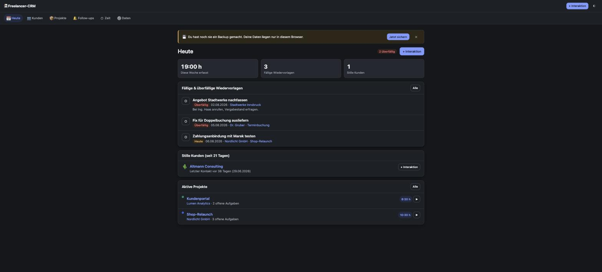
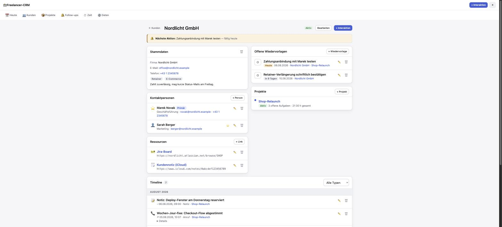
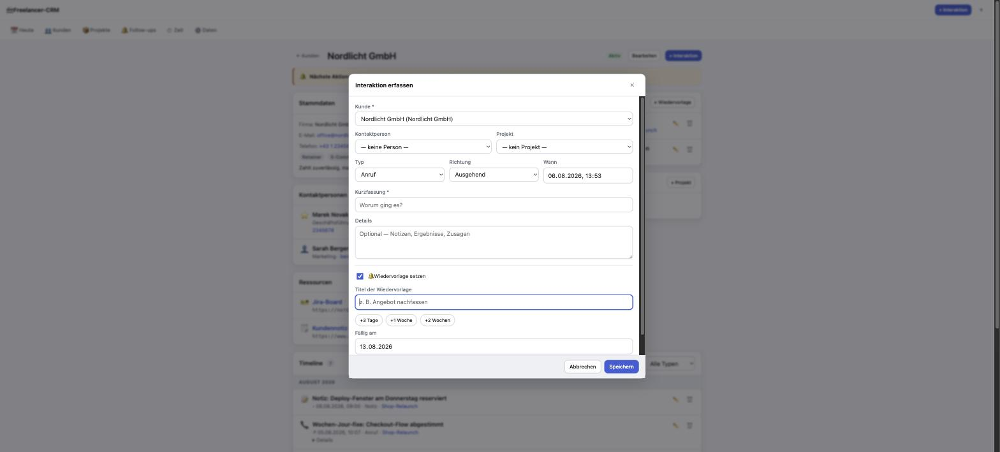
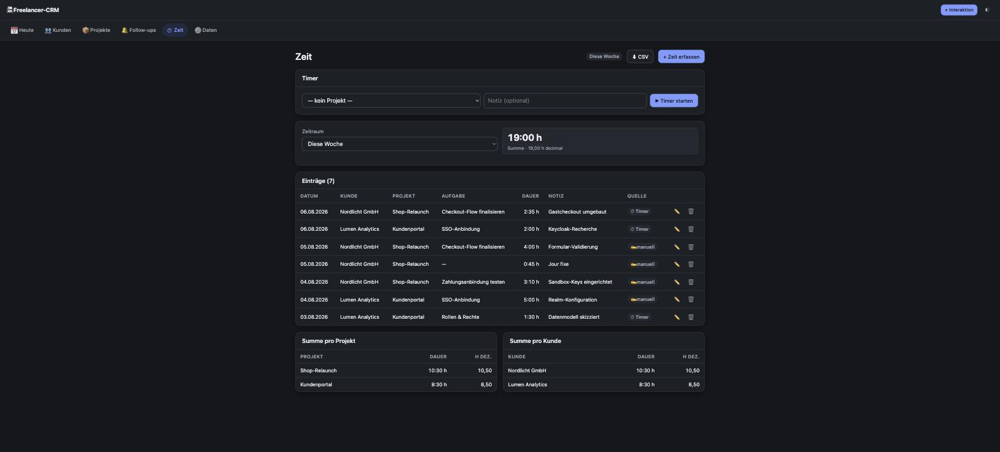

# Freelancer-CRM

> Ein schlankes, lokales CRM für Software-Freelancer. Eine einzige HTML-Datei, keine externen Abhängigkeiten, alle Daten bleiben im Browser.

Kein aufgeblähtes Sales-CRM — ein Werkzeug, das bei der **Kommunikation mit Kunden** unterstützt und die gängigsten wiederkehrenden Todos an einem Ort abwickelt.

---

## Warum

Als Freelancer mit einer Handvoll Kunden verteilt sich alles Wichtige über E-Mail-Postfach, Kopf und verstreute Notizen. Es fehlt ein zentraler Ort, der

- festhält, **was** mit welchem Kunden zuletzt besprochen wurde,
- daran erinnert, **wann** man sich wieder melden sollte,
- zeigt, welche Kunden gerade **still** geworden sind.

Genau das leistet dieses Tool — und sonst bewusst nichts.

---

## Prinzipien

| Prinzip | Umsetzung |
|---|---|
| **Single-File** | Die gesamte App ist eine `index.html` (HTML + `<style>` + `<script>`). Kein Build, kein Framework, kein `npm install`. |
| **Lokal & privat** | Alle Daten liegen in **IndexedDB** im Browser. Kein Server, keine Cloud, kein Tracking. |
| **Null Abhängigkeiten** | Keine CDNs, keine Web-Fonts, keine externen Requests. System-Fonts, Emoji-Icons. |
| **Performant & minimal** | Vanilla JS, CSS-Variablen, Hash-Routing, Event-Delegation. Schnell und wartbar. |
| **Datensouveränität** | Ein-Klick-Backup als JSON. Die Daten gehören dir und sind jederzeit exportierbar. |

---

## Funktionen

### Herzstück — der Quick-Add-Loop
Nach jedem Call/Mail/Meeting in ~10 Sekunden festhalten, was war — und im selben Schritt optional die nächste Wiedervorlage setzen (Schnell-Chips: +3 Tage / +1 Woche / +2 Wochen). Ein Submit legt Interaktion **und** verknüpftes Follow-up an. Dieser Loop macht aus dem Tool eine echte Kommunikations-Stütze statt einer Karteikartei.

### Die drei Säulen
1. **Kontakte & Historie** — Kunden (Firma/Person) mit Kontaktpersonen; pro Kunde eine chronologische Timeline aller Interaktionen (Anruf, E-Mail, Meeting, Notiz, Nachricht).
2. **Follow-ups / Wiedervorlagen** — datierte Nudges („Angebot nachfassen"), erscheinen automatisch am Dashboard, sobald fällig/überfällig.
3. **Projekte & Zeit** — Projekte pro Kunde mit Aufgaben; Zeiterfassung (manuell + Live-Timer, übersteht Reload); CSV-Export als Basis für die Abrechnung.

### Smarte Signale
- **Stille Kunden** — aktive Kunden ohne Kontakt seit *N* Tagen (Standard 21) werden am Dashboard hervorgehoben.
- **Nächste Aktion pro Kunde** — jeder Kunde zeigt seinen nächsten Schritt (fällige Wiedervorlage oder „seit X Tagen kein Kontakt").

### Quick-Links zu deinen Tools
Pro Kunde und Projekt eine kleine Liste benannter Links — Apple Note, Jira-Board, GitHub-Repo, Confluence, Ordner. Ein Klick öffnet das Ziel. Der CRM speichert nur `Label + URL`, liest nie Inhalte; der Typ (Icon) wird aus der URL erkannt.

**Was ein Link öffnen kann (ehrlich):**

| Typ | Verhalten |
|---|---|
| ✅ Web-Links (`https://`) — Jira, GitHub, Confluence, Figma, iCloud-Notes-Share-Link | öffnen zuverlässig in neuem Tab |
| ✅ App-Schemes (`notes://`, `things:`), `mailto:`, `tel:` | funktionieren, evtl. einmalige OS-Nachfrage |
| ⚠️ Lokale Ordner (`file://`) | Browser blockt den Klick von einer `http`-Seite (Sicherheit). Fallback: Button **„Pfad kopieren"** → in Finder mit ⌘⇧G einfügen |

> **Apple-Note verlinken:** In Notes → Teilen → **Zusammenarbeiten** → „Link kopieren" ergibt eine `icloud.com/notes/…`-URL, die die Notiz öffnet (macht die Notiz mit dir selbst „geteilt"). Diese URL als Quick-Link einfügen.

---

## Screens

Globale Leiste: Titel, **Theme-Toggle** (☀/🌙/Auto), immer sichtbarer **„+ Interaktion"**-Button, laufender Timer-Chip. Navigation: oben (Desktop) / unten (Mobil).

- **Heute (Dashboard)** — fällige & überfällige Follow-ups · stille Kunden · aktive Projekte mit Wochenzeit · Wochenstunden · Backup-Erinnerung.
- **Kunden** — Liste (Suche, Status-Filter, „letzter Kontakt vor…", Badge offener Follow-ups) → **Detail** mit Stammdaten, Kontaktpersonen, **Ressourcen-Karte** (Quick-Links), offenen Follow-ups, Projekten und der **Timeline**.
- **Projekte** — Liste (gruppiert nach Kunde) → Detail mit Aufgaben (todo/doing/done), erfasster Zeit, Timer-Start, Ressourcen und projektbezogenen Interaktionen.
- **Follow-ups** — filterbare Liste (Offen/Erledigt · überfällig/diese Woche/später · nach Kunde), inline abhaken.
- **Zeit** — Timer-Widget · manuelle Erfassung (`1:30`, `90m`, `1,5h`) · Einträge-Tabelle · Summen pro Projekt/Kunde/Woche · **CSV-Export** (de-AT, Semikolon, Dezimalkomma).
- **Daten & Einstellungen** — Theme, „stille Kunde"-Schwelle, Backup-Intervall, **Backup export/import**, Beispieldaten, „alle Daten löschen".

### Screenshots

| Heute (dunkel) | Kundendetail (hell) |
|---|---|
|  |  |

| Quick-Add mit Wiedervorlage | Zeit & Auswertung |
|---|---|
|  |  |

---

## Datenmodell

Ein Wurzel-Dokument mit flachen Arrays je Entität (englische Keys im Code, deutsche Labels im UI). Flach statt verschachtelt → entitätsübergreifende Queries bleiben trivial.

| Entität | Wichtigste Felder | Beziehung |
|---|---|---|
| **Client** (Kunde) | `id`, `name`, `company`, `email`, `phone`, `tags[]`, `notes`, `status` (`active`/`lead`/`paused`/`archived`) | — |
| **Contact** (Person) | `id`, `clientId`, `name`, `role`, `email`, `phone`, `isPrimary` | → Client |
| **Link** (Quick-Link) | `id`, `ownerType` (`client`/`project`), `ownerId`, `label`, `url`, `kind` (auto: `note`/`repo`/`ticket`/`docs`/`design`/`folder`/`mail`/`web`) | → Client **oder** Project |
| **Interaction** | `id`, `clientId`, `contactId?`, `projectId?`, `type` (`call`/`email`/`meeting`/`note`/`message`), `direction` (`in`/`out`/`internal`), `occurredAt`, `summary`, `body` | → Client (+ optional Contact/Project) |
| **Followup** | `id`, `clientId?`, `projectId?`, `title`, `notes`, `dueDate` (`YYYY-MM-DD`), `status` (`open`/`done`), `sourceInteractionId?`, `completedAt?` | → Client/Project (optional) |
| **Project** | `id`, `clientId`, `name`, `description`, `status` (`active`/`onhold`/`done`/`archived`), `color` | → Client |
| **Task** | `id`, `projectId`, `title`, `status` (`todo`/`doing`/`done`), `estimateMinutes?`, `order` | → Project |
| **TimeEntry** | `id`, `projectId`, `taskId?`, `startedAt`, `endedAt?`, `durationMinutes`, `note`, `source` (`timer`/`manual`) | → Project (+ optional Task) |

Zusätzlich `meta`: `createdAt/updatedAt`, `lastBackupAt`, `activeTimer` (Reload-Recovery), `settings` (theme, staleDays, backupIntervalDays) und `schemaVersion`.

**Follow-up ≠ Task — bewusst getrennt:** Eine Wiedervorlage ist ein *datierter Nudge zur Beziehungspflege* (`open/done` + `dueDate`, oft ohne Projekt). Ein Task ist ein *Scope-Item im Projekt* (`todo/doing/done`). Zusammenlegen würde beide Modelle mit `null`-Feldern verwässern. Das Dashboard vereint sie trotzdem in einer „Heute dran"-Ansicht.

---

## Technische Architektur

Der `<script>`-Block ist in klar kommentierte Abschnitte gegliedert:

```
Konstanten/Enums → State → DB-Layer (IndexedDB) → Migrationen →
Persist+Render-Loop → Utilities → Selektoren/Queries → Views →
Router → Modals/Forms → Form-Handler → Timer → Backup → Toast →
Actions (Event-Delegation) → Theme+Events → Demo-Daten → Boot
```

- **Persistenz:** ein JSON-Blob in einem IndexedDB-Object-Store, komplett in-memory gehalten, ~400 ms **debounced** geschrieben, mit sofortigem Flush bei `pagehide`/`visibilitychange`. „Queries" sind schlichte `.filter/.sort`. Die Datenmenge ist winzig (wenige Kunden, ein paar hundert Interaktionen/Jahr).
- **Rendering ohne Framework:** zentrales `state`-Objekt · **Hash-Router** (`#/clients/:id` …) · pro View eine `renderX()`-Funktion, die einen HTML-String in `#app` schreibt · **Event-Delegation** über `data-action`/`data-form` · Re-Render per `requestAnimationFrame` gebündelt.
- **Schema-Versionierung:** `migrate()` läuft beim Laden **und** beim Import; neue Entitäts-Arrays kommen per Migration mit leerem Default dazu (bestehende Daten brechen nie). Backup aus neuerer Version wird abgelehnt statt korrumpiert.
- **Multi-Tab-Schutz:** `BroadcastChannel` meldet Saves; andere Tabs laden neu (last-write-wins) + dezenter Hinweis.
- **IDs** via `crypto.randomUUID()`. **Theming** über CSS-Variablen mit `@media (prefers-color-scheme)` plus manuellem `data-theme`-Override. **Formatierung** via `Intl` mit `de-AT`.

---

## Datensicherheit & Backup

Bei lokaler Datenhaltung ist Backup das A und O:

- **Export (1 Klick):** ganzes Dokument → Download `crm-backup-YYYY-MM-DD.json`; setzt `lastBackupAt`.
- **Import/Restore:** Datei → validieren → ggf. migrieren → Wahl **Ersetzen** (Standard) vs. **Zusammenführen** (per `id`, eingehend gewinnt) → **Rückgängig** innerhalb der Session möglich.
- **Backup-Erinnerung:** dezente, wegklickbare Leiste am Dashboard, wenn das letzte Backup älter als das eingestellte Intervall (Standard 7 Tage) ist.

---

## Tastatur

Für den täglichen Gebrauch — die Kürzel greifen nicht, während in einem Eingabefeld getippt wird.

| Taste | Wirkung |
|---|---|
| `n` | Neue Interaktion (Quick-Add) |
| `/` | Fokus ins Suchfeld des aktuellen Screens |
| `g` dann `h` / `k` / `p` / `f` / `z` / `d` | Heute / Kunden / Projekte / Follow-ups / Zeit / Daten |
| `t` | Laufenden Timer stoppen bzw. Timer-Auswahl öffnen |
| `⌘/Strg + Enter` | Formular abschicken |
| `Esc` | Dialog schließen |
| `?` | Übersicht aller Kürzel |

---

## Roadmap

**✅ Umgesetzt (v1.0)**
Kunden & Kontakte · Interaktions-Timeline · Quick-Add-mit-Follow-up · Follow-ups · Quick-Links · Dashboard-Signale ·
Projekte & Aufgaben · Zeiterfassung (Timer mit Reload-Recovery + manuell) · Auswertungen · CSV-Export ·
JSON-Backup mit Ersetzen/Zusammenführen/Rückgängig · Backup-Erinnerung · Schema-Migrationen ·
Multi-Tab-Schutz · Dark/Light/Auto-Theme · Tastatur-Kürzel · Beispieldaten.

**🔜 Bewusst zurückgestellt** (Architektur lässt Platz, kein Rewrite nötig)
- Angebote & Rechnungen (Erstellung, Status, PDF-Export)
- E-Mail-Vorlagen/-Textbausteine, optional Versand-Log
- Kalender-Sync für Termine & Erinnerungen
- Cloud-Sync / Multi-Device
- Datei-Anhänge, Volltextsuche
- Apple-Note-per-Titel-Links ohne „Teilen" (bräuchte einen kleinen lokalen AppleScript-Helfer → weicht das Single-File-Prinzip auf)

---

## Setup & Ausführung

Die App braucht einen (statischen) HTTP-Origin, damit IndexedDB zuverlässig persistiert — nicht per Doppelklick öffnen, sondern lokal servieren:

```bash
python3 -m http.server 8125 -d crm
```

Dann **http://localhost:8125** öffnen. Immer denselben Host+Port verwenden — IndexedDB ist origin-gebunden, ein anderer Port zeigt „leere" Daten.

> In `claudes-world` ist der Server bereits als `.claude/launch.json`-Eintrag `crm` (Port 8125) hinterlegt.

**Erste Schritte:** Die App startet mit einem Willkommens-Screen. „Beispieldaten laden" zeigt alle Funktionen an einem realistischen Datensatz; „Daten → Alle Daten löschen", sobald du mit echten Kunden startest.

---

## Projektstruktur

```
crm/
├── index.html          # die gesamte App (HTML + CSS + JS)
└── TESTING.md          # manuelle QA-Checkliste
docs/screenshots/       # Bilder für dieses Dokument
README.md               # dieses Dokument
```

Die **App** ist eine Datei. Mehr braucht es nicht — alles andere ist Dokumentation
und wird zum Betrieb nicht ausgeliefert.

---

## Bekannte Grenzen

Bewusste Konsequenzen des Single-File-/Lokal-Prinzips:

- **Kein Server, kein Multi-Device.** Die Daten leben in der IndexedDB *dieses* Browsers auf *diesem* Gerät.
  Ein anderer Browser, ein anderer Rechner oder ein anderer Port zeigt „leere“ Daten.
- **Backup liegt in deiner Verantwortung.** Es gibt keine Cloud, die im Hintergrund sichert.
  Die Backup-Erinnerung am Dashboard ist der einzige Schutz — nimm sie ernst.
- **Privater Modus / gelöschte Website-Daten löschen alles.** Auch „Browserdaten löschen“ im Browser trifft die App.
- **`file://`-Quick-Links** lassen sich aus Sicherheitsgründen nicht per Klick öffnen; die App bietet stattdessen „Pfad kopieren“.
- **Kein Konfliktabgleich zwischen Tabs.** Zwei offene Tabs arbeiten nach *last-write-wins*;
  der zweite Tab lädt nach jedem fremden Save neu.
- **Keine Volltextsuche über Interaktionstexte** — gesucht wird über Kunden, Firmen, Tags und Projektnamen.
